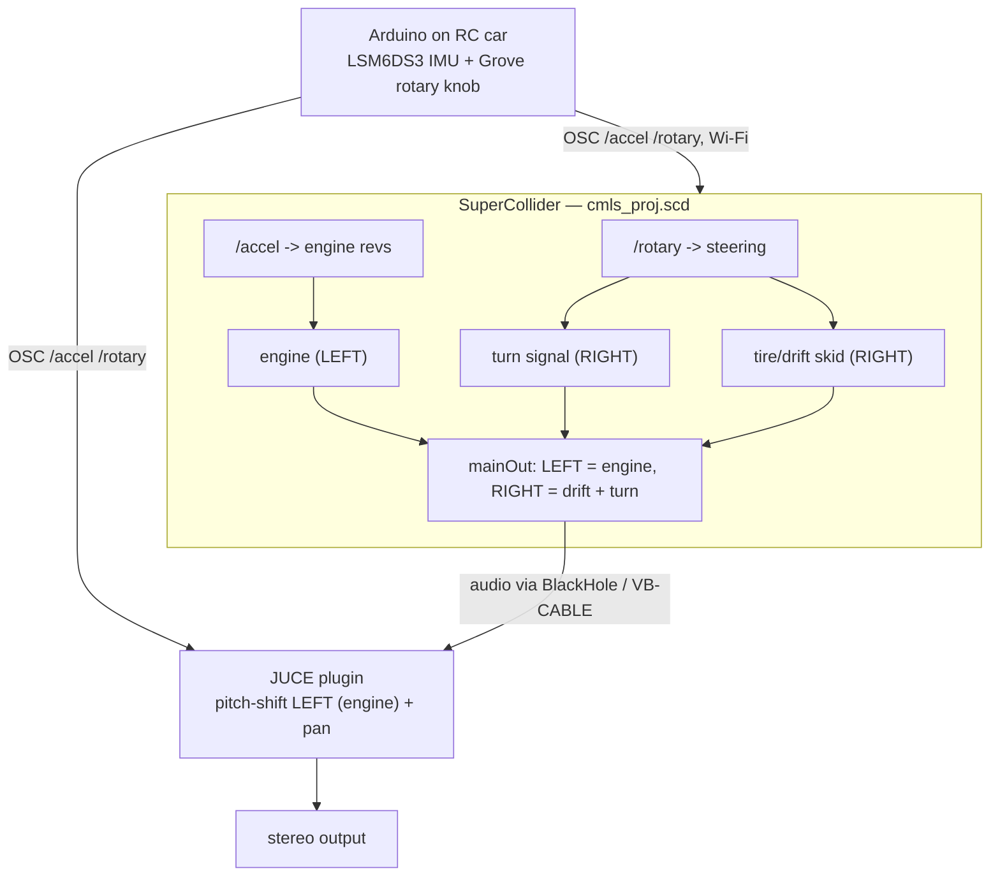

# NoteDance — Sensor-Driven Car Soundscape

NoteDance turns the motion of an RC car into a live car soundscape. An Arduino
on the car streams sensor data over Wi-Fi as OSC; **SuperCollider** synthesises
the sounds and a **JUCE plugin** processes them.

- **SuperCollider** — the car soundscape: engine, tire/drift skid, and a
  rhythmic turn-signal melody.
- **JUCE plugin (NoteDance)** — pitch-shifts and pans the audio under OSC control.
- **Arduino firmware** — reads an IMU + a steering knob and sends OSC over Wi-Fi.
- **Python bridge (optional)** — a mock/serial sensor source for testing
  SuperCollider without the car.

## Signal Flow



- **Steering** (Grove rotary, `/rotary`) → turn signal, plus a tire skid on hard turns.
- **Acceleration** (IMU, `/accel`) → engine revs.
- Stereo split: **LEFT = engine**, **RIGHT = drift + turn**, so the plugin
  pitch-shifts only the engine and leaves the rest untouched.
- SC audio reaches the plugin through a virtual audio device (BlackHole / VB-CABLE).

## Hardware

- RC car with an **Arduino UNO WiFi Rev2** on top, powered by a 4×AA pack —
  fully wireless.
- Onboard **LSM6DS3** accelerometer → `/accel` (X, Y in g).
- **Grove rotary angle sensor** on `A0`, mechanically linked to the steering by
  a wire arm → `/rotary` (raw ≈ 488 right … 498 centre … 509 left).
- The firmware (`ReadAccelerometer.ino`) connects to Wi-Fi and streams OSC to
  **both** the JUCE plugin (`<pc-ip>:9001`) and SuperCollider (`<pc-ip>:57120`).

## OSC Protocol

| Address   | Args           | Meaning                                            |
|-----------|----------------|----------------------------------------------------|
| `/rotary` | `raw` float    | steering knob (≈488 right, ≈498 centre, ≈509 left) |
| `/accel`  | `ax ay` floats | IMU X/Y acceleration in g                          |

Ports: **JUCE `9001`**, **SuperCollider `57120`**. SuperCollider *also* accepts
the Python-bridge protocol (`/sensor/accel|tilt|shake|turn`) for hardware-free
testing, but the car only sends `/rotary` + `/accel`.

## How To Run (full end-to-end)

1. Install **SuperCollider**, **JUCE**, the **Arduino IDE**, and a virtual audio
   driver (**BlackHole** on macOS, **VB-CABLE** on Windows).
2. Build the **NoteDance** plugin from `juce/NoteDance.jucer`, or use a prebuilt
   `NoteDance.vst3`.
3. Open JUCE's **AudioPluginHost** (`JUCE/extras/AudioPluginHost`) and load
   `NoteDance.vst3`.
4. **Route SuperCollider's audio into the plugin host** through the virtual
   audio device (set SC's output device and the host's input both to
   BlackHole / VB-CABLE).
5. Open `supercollider/cmls_proj.scd`; evaluate block 0, run `s.boot`, then
   evaluate blocks 1–5 and `~start.value;`.
6. Upload `ReadAccelerometer.ino` to the Arduino and power on the board on the car.
7. Steer / accelerate → turn signal, skid, and engine revs, processed by the plugin.

No hardware? Run the self-contained SC demo (boots, loads, plays engine →
throttle → drift → turn signals → stop):

```bash
sclang supercollider/test.scd
```

## SuperCollider

`supercollider/cmls_proj.scd` is the sound source. It synthesises three voices
and splits them hard across the stereo field:

| Voice              | Channel | Driven by                                           |
|--------------------|---------|-----------------------------------------------------|
| engine             | LEFT    | `/accel` energy → idle ↔ high revs                  |
| tire / drift skid  | RIGHT   | `/rotary` hard turn (hysteresis: on 0.7 / off 0.55) |
| turn-signal melody | RIGHT   | `/rotary` steering (hysteresis: on 0.35 / off 0.25) |

Files: `cmls_proj.scd` (main), `engine.scd` (engine SynthDef, auto-loaded),
`test.scd` (one-shot, no-hardware demo).

Manual run: open `cmls_proj.scd`, `s.boot`, evaluate blocks 1–5, then
`~start.value;` / `~stop.value;`.

Live tuning (evaluate any time):

```supercollider
~params.rotaryCenter = 498;   ~params.rotarySpan = 10;          // knob calibration
~params.turnOnThreshold = 0.35; ~params.turnOffThreshold = 0.25; // turn signal
~params.driftOnThreshold = 0.7; ~params.driftOffThreshold = 0.55; // skid
~params.rollPanPolarity = -1;   // flip if left/right is reversed
```

## JUCE Plugin (NoteDance)

`juce/` is a full JUCE plugin:

- stereo in/out, input/output gain
- pitch shifting (engine) + panning, driven by OSC on port `9001`
- custom UI with rotary controls
- Standalone and VST3 build targets

| File                      | Purpose                                   |
|---------------------------|-------------------------------------------|
| `PluginProcessor.cpp/.h`  | audio processing + parameters             |
| `PluginEditor.cpp/.h`     | custom UI                                 |
| `Parameters.h`            | input, output, pitch, mix, pan parameters |
| `OSCReceiverComponent.h`  | OSC input on `9001` (`/accel`, `/rotary`) |
| `MyPitchShifter.h`        | custom pitch shifter                      |
| `MyPanner.h`              | custom stereo panner                      |

Build: open `juce/NoteDance.jucer`, or the generated solutions
`juce/Builds/VisualStudio2022/NoteDance.sln` (or `VisualStudio2026`), and build
`NoteDance_StandalonePlugin` or `NoteDance_VST3`.

## Python Bridge (optional, not used by the car)

`bridge/bridge.py` is **not** in the live signal path — the firmware sends OSC
over Wi-Fi directly. It's kept only to test SuperCollider without the car: it
emits the `/sensor/*` protocol from a `--mock` sine or from a serial sensor.

```bash
cd bridge
python3 -m venv venv && source venv/bin/activate
pip install -r requirements.txt
python3 bridge.py --mock --debug
```

## Repository Layout

```text
NoteDance/
|-- supercollider/   cmls_proj.scd (main) · engine.scd · test.scd
|-- juce/            NoteDance JUCE plugin (Source/, Builds/, .jucer)
|-- arduino/         Arduino firmware (ReadAccelerometer.ino)
|-- bridge/          optional Python mock/serial -> OSC bridge
|-- docs/            notes, diagrams, report / demo material
`-- README.md
```

## Team Workflow

- Keep `main` demo-ready.
- Use small feature branches.
- Coordinate before changing OSC address names or argument types.
- Update this README when the firmware / SC / JUCE protocol changes.
